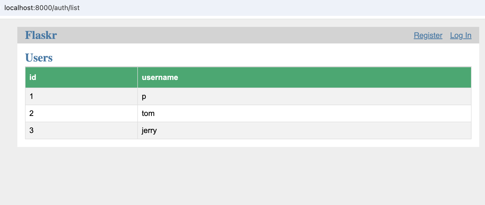

# hw-blog

## Install

Get a copy of the flaskr app from https://github.com/pallets/flask/tree/main/examples/tutorial and run it

* Note: I didn't follow their install instructions, which use pip and venv
* I simply cloned the repo and made a recursive copy of the flaskr demo with...
  ```
  make setup
  ```
* Initialize the database and run the demo with
  ```
  make run
  ```
* Then browse to http://127.0.0.1/8000

## Step 1

* Start the app
  ```
  make run
  ```
* Update the Makefile so that
  ```
  make users
  ```
  registers several users with curl

## Step 2

Add a route to the auth blueprint
(see: [Blueprints & Views](https://flask.palletsprojects.com/en/stable/tutorial/views/)
that lists the all the registered users.
Hint: The [Blog Blueprint](https://flask.palletsprojects.com/en/stable/tutorial/blog/)
lists all the blogs.

## Step 3

Add a template for listing the users in an HTML table

## Step 5

Style the table by adapting the CSS from the first example in this demo: https://www.w3schools.com/css/css_table.asp

## Run it

If everything is working, then

* Start the app
  ```
  make run
  ```
* In another terminal, 
  ```
  make users
  ```
* Browse to http://localhost:8000/auth/list and you should see something like this...


